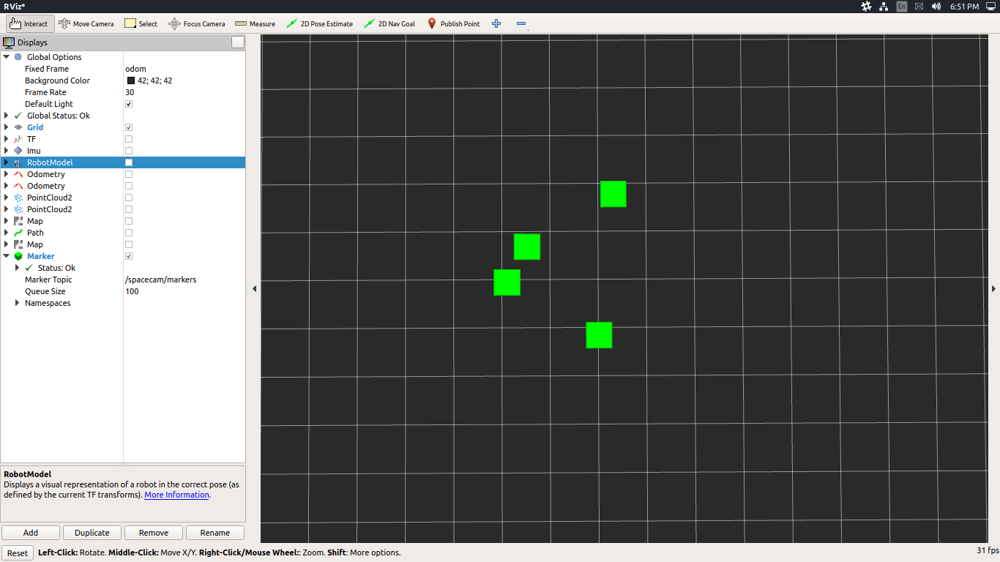

# SpaceCam ROS bridge

The firmware of the device is publishing a multiarray message on `spacecam/trackpoints` topic, either on serial port or over Wifi. Connect to the tracker through rosserial: `roslaunch spacecam_bridge wifibridge.launch`.

#### Various nodes to utilize the IR tracker datastream

There are at least two POSIT implementations for 3 or 4 point 3D model pose estimation and also some marker order sorting algorithms.

e.g. _"love at first sight"_ - silly marker sorting:

### To Do
* **trackpoint_publisher** node should be integrated into the Gazebo plugin instead
